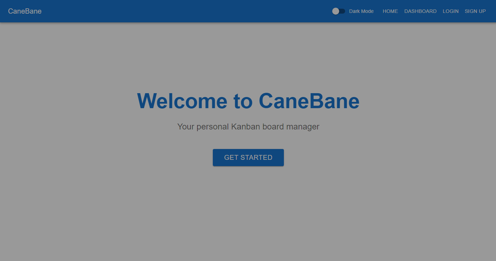

# CaneBane - Kanban Board Application

CaneBane is a Kanban board application that helps you manage your tasks and projects efficiently. This README will guide you through the setup process and how to use the application.



## Prerequisites

Before you begin, ensure you have the following installed on your system:

- Node.js (v14 or later)
- npm (usually comes with Node.js)
- MongoDB (v4 or later)

## Setup

1. Clone the repository:
   ```
   git clone https://github.com/your-username/canebane.git
   cd canebane
   ```

2. Install dependencies for both the server and client:
   ```
   cd server && npm install
   cd ../client && npm install
   ```

3. Create a `.env` file in the `server` directory with the following content:
   ```
   PORT=5000
   MONGODB_URI=mongodb://localhost:27017/canebane
   JWT_SECRET=your_secret_key_here
   ```
   Replace `your_secret_key_here` with a secure random string.

4. Start MongoDB on your local machine.

5. Start the server:
   ```
   cd server
   npm run dev
   ```

6. In a new terminal, start the client:
   ```
   cd client
   npm start
   ```

7. Open your browser and navigate to `http://localhost:3000` to use the application.

## Usage

1. Sign up for a new account or log in if you already have one.
2. Once logged in, you'll be redirected to the dashboard.
3. Create a new board or join an existing one using a board code.
4. In a board view, you can:
   - Add new tasks
   - Drag and drop tasks between columns
   - Update task status
   - View and edit task details
   - Assign tasks to other users of the board
   - Change to Dark Mode
   - Change color of a task
   - Delete a task or a board
   - Set WIP Limit for Column
   - Create a done rule for a column

## Project Structure

- `client/`: React frontend application
- `server/`: Express.js backend application
- `server/models/`: MongoDB schemas
- `server/routes/`: API routes
- `server/controllers/`: Business logic for API endpoints
- `client/src/components/`: React components
- `client/src/pages/`: React pages/views
- `client/src/services/`: API and authentication services

## Contributing

If you'd like to contribute to this project, please fork the repository and create a pull request with your changes.

## License

This project is licensed under the MIT License.